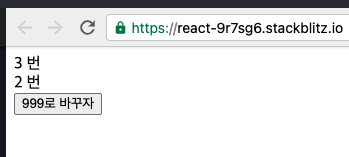

# 얕은 비교 \(ShallowEqual\)

리액트에서 상태를 비교할때 **얕은 비교**를 한다는 말을 많이 보았을 것이다. 드디어 이 얕은 비교를 어떻게 하는지 알아보자. 얕은 비교는 Dependency array에서 한다. 우리는 Dependency array에 값을 항상 **새로운 값을 줘야하는 것**을 습관처럼 해왔을 것이다. 이번 장에서는 왜 새로운 값을 줘야하는지 알아보자.

#### Dependency array

```jsx
function Component(){
  // useEffect
  useEffect(() => {
    // effect
    return () => {
      cleanup
    }
  }, [input]) // Dependency array
    
// useCallback
  const handler = useCallback(
    () => {
      callback
    },
    [input], // Dependency array
  )
  retutrn <.../>  
}
```

\[input\] 부분이 Dependency Array 라는 것을 알것이다. 해당 Array를 Dependency Array라고 부르고 있다. 


#### 비교 순서

얕은비교는 아래와 같이 비교한다.

1. Object.is\(es6\)  를 통해서 비교하여, 같으면 **true**를 반환해준다.
2. objA,objB가 object, null이 아니면 **false**
3. objA 와 objB의  key의 갯수가 다른가? **false**
4. objB가 objA가 가진 key가지고 있는가? 같은 object인가? 다르면 **false**
5. true

여기서 **false**가 나오면 리렌더링 로직을 하게된다.  

```typescript
// https://github.com/facebook/fbjs/blob/master/packages/fbjs/src/core/shallowEqual.js#L39-L67
function shallowEqual(objA: mixed, objB: mixed): boolean {
  if (is(objA, objB)) {
    return true;
  }

  if (typeof objA !== 'object' || objA === null ||
      typeof objB !== 'object' || objB === null) {
    return false;
  }

  const keysA = Object.keys(objA);
  const keysB = Object.keys(objB);

  if (keysA.length !== keysB.length) {
    return false;
  }

  // Test for A's keys different from B.
  for (let i = 0; i < keysA.length; i++) {
    if (
      !hasOwnProperty.call(objB, keysA[i]) ||
      !is(objA[keysA[i]], objB[keysA[i]])
    ) {
      return false;
    }
  }

  return true;
}

```



ES6의 Object.is\(\) 코드


```javascript
// 참고 https://developer.mozilla.org/ko/docs/Web/JavaScript/Reference/Global_Objects/Object/is
if (!Object.is) {
  Object.is = function(x, y) {
   // SameValue 알고리즘
    if (x === y) { // Steps 1-5, 7-10
     // Steps 6.b-6.e: +0 != -0
      return x !== 0 || 1 / x === 1 / y;
   } else {
     // Step 6.a: NaN == NaN
     return x !== x && y !== y;
   }
  };
}

```


### 새로운 값을 줘야 하는 이유

```jsx
function Component() {
  const [state, setState] = useState({
    data: {
      value: 1,
      depth2: {
        value: 2,
        depth3: {
          value: 3,
        },
      },
    },
  });

  return 'rendering';
}
```

다음과 같이 있을 때,

#### I. 잘못된 상태 변경

```jsx
import React, { useState } from 'react';
import './style.css';

function Display() {
  const [state, setState] = useState({
    data: {
      value: 1,
      depth2: {
        value: 2
      }
    }
  });

  const handleOnClick = () => {
    state.data.depth2.value = 999;
    setState({
      data: {
        value: 3,
        depth2: state.data.depth2
      }
    });
  };
  // NOTE: 새로 그리지 못한다.
  const NotRerenderingComponent = React.useMemo(
    () => <div> {state.data.depth2.value} 번</div>,
    [state.data.depth2]
  );

  return (
    <div>
      <div> {state.data.value} 번</div>
      {NotRerenderingComponent}
      <button onClick={handleOnClick}>999로 바꾸자</button>
    </div>
  );
}

export default function App() {
  return (
    <div>
      <Display />
    </div>
  );
}

```



여기서 999로 바꾸자를 클릭하였지만, 2번째줄은 여전히 2번을 렌더링한다.

얕은 비교에서는 `data.depth2` 는 값이 같다고 판단하여 리렌더링을 못하는 문제가 발생한다.

그러므로 우리는 항상 새로운 값을 줄 수 있도록 해야한다.

```jsx
  const handleOnClick = () => {
    state.data.depth2.value = 999;
    setState({
      data: {
        value: 3,
        depth2: {...state.data.depth2}
      }
    });
  };
```

ES6 문법인 스프레드 문법을 쓰면 해결된다. \(spread 문법은 새로운 객체를 만든다.\)

