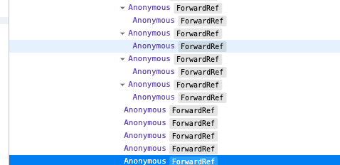

# Anonymous 해결하기



React Developer Tools를 이용하다 보면, 위에 처럼 **Anonymous**로 표시되는 경우를 보았을 것이다.

export default를 통해서 하게되면 **Anonymous**로 인식하게 된다. 그러므로. 아래와 같이 분리하도록 하자.


코드 작성시 아래와 같이 작성하면 **Anonymous** 로 표시된다**.**

```javascript
export const Button = () => {}
```

그러므로, 분리하여 작성하도록 하자.

```javascript
const Button = () => {}
export Button;
```

\* 만약 babel에서 해당 이슈 관련해서 plugin이 추가될 수도 있다.

