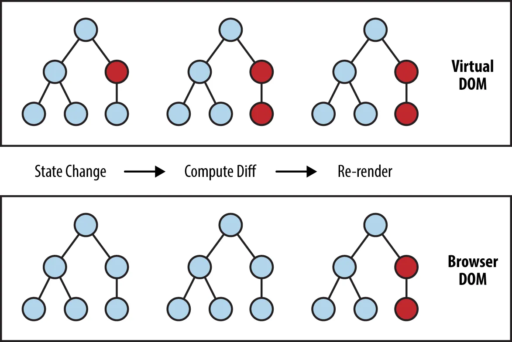

# Virtual DOM

Virtual DOM은 **메모리**상에서 비교하는 것을 말한다. 실제로 존재하는 DOM Tree가 아니기에 Virtual DOM이라고 부른다. 여기서 실제 DOM하고 동기화 하는 과정을 [재조정\(Reconciliation\)](../core/reconciliation.md) 이라고 한다. 재조정이 되는 과정은 해당링크를 통해서 보돌고 한다.

