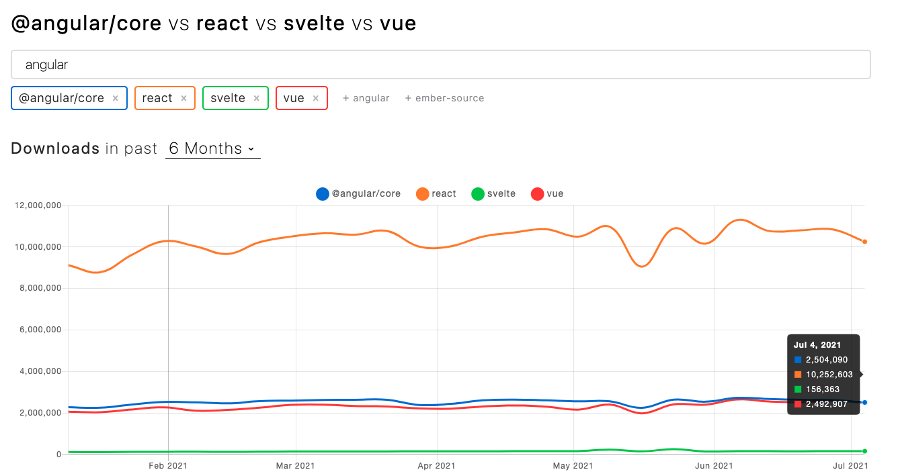

# 앞으로의 React

리액트는 현재 프레임워크 중 제일 많이 사용하는 프레임워크 입니다. 대부분의 프로젝트가 이미 React로 구현되고 있으며, 지금 새로운 프레임워크가 나온다고 해도, 유지보수때문에 약 10년까지는 먹고사는데 문제 없습니다. 백엔드에서 아직까지 JAVA만 쓰는 이유도 같은 이유입니다. 지금은 null exepction 같은 문제와 여럿 좋은 기능때문에 Kotlin으로 옮기는 추세이긴 하지만, 여전히 Java를 많이 사용합니다. 몇 몇 스타트업은 Nodejs, Django를 쓰긴 하지만, 결국 Java로 가는 경우를 많이 보았습니다. \( php는 언급하지 맙시다...^^ \) 

